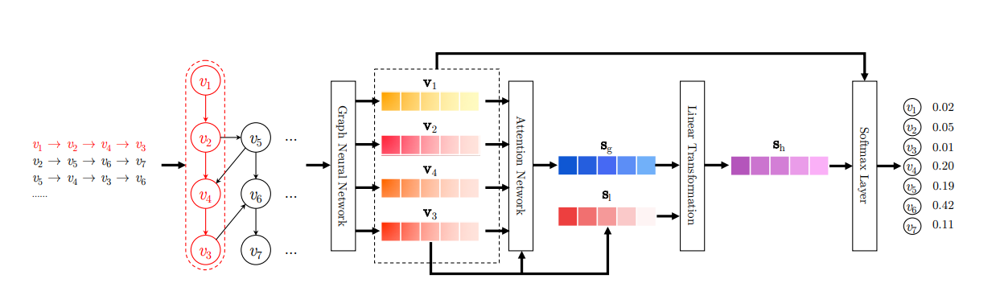
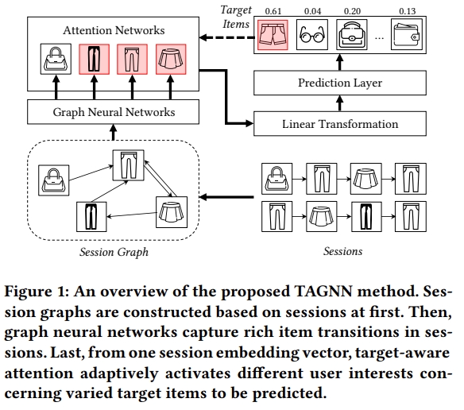

# Model Contract

Session-based recommenders built on top of a shared graph scaffold. All models consume the same parquet schema, expose the same Python API, and plug into the same Trainer / Evaluator / Pipeline without modification.

---

## Shared Input Schema

Every model reads the same parquet columns produced by the preprocessing pipeline:

| Column | Type | Description |
|---|---|---|
| `x` | `int64[]` | Unique item IDs in the session graph (nodes) |
| `edge_index` | `int64[][]` | `[src_indices, dst_indices]` — transitions between nodes |
| `alias_inputs` | `int64[]` | Maps each sequence position → node index in `x` |
| `item_seq_len` | `int64` | Length of the original interaction sequence |
| `pos_items` | `int64` | Target item ID (next item to predict) |

---

## Shared Code Layer — `graph_helpers.py`

All models import from this module. Nothing is duplicated across model files.

```
graph_helpers.py
├── build_adjacency()          standard SR-GNN normalised in/out  → (n, 2n)
├── build_adjacency_ngc()      global-freq weighted edges         → (n, 2n)
├── build_adjacency_fc()       local + full-connection augmented  → (n, 4n)
├── SessionGraphDataset        torch Dataset wrapping parquet rows
├── collate_graph_batch()      pads variable-size graphs to dense batch
├── GNNCell                    SR-GNN gated propagation cell
├── SessionEncoderBase         nn.Module interface all cores implement
└── GraphRecommenderBase       fit / recommend / save / load scaffold
```

Every model class implements exactly **5 hooks**:

```python
_build_core()           # returns the nn.Module
_make_dataset(df)       # returns SessionGraphDataset (or subclass)
_graph_from_sequence()  # builds graph tensors for live inference
_forward_batch(batch)   # one training forward pass → logit scores
_tensors_from_graph()   # builds tensors for recommend_from_graph()
```

---

## Models

### 1. SR-GNN — Session-based Recommendation with Graph Neural Networks

> Wu et al., AAAI 2019

**Core idea:** Model the session as a directed graph. Run gated GNN propagation to let each item aggregate information from its neighbours. Read out the session representation by blending the last-item embedding with a soft-attention global context.

```
Session sequence:  A → B → A → C → B




```

**Six readout variants — same GNN, different final pooling:**

| Variant | Key | Adjacency | Readout |
|---|---|---|---|
| `srgnn` | Original | local (2n) | last-item + attention |
| `srgnn-ngc` | Normalised Global Connections | global-freq weighted (2n) | last-item + attention |
| `srgnn-fc` | Full Connections | local + all-pairs boolean (4n) | last-item + attention |
| `srgnn-l` | Local only | local (2n) | last-item only |
| `srgnn-avg` | Average pooling | local (2n) | mean over sequence + last-item |
| `srgnn-att` | Attention only | local (2n) | attention only (no last-item branch) |

**NGC note:** Global co-occurrence matrix stored as a sparse dict `{(src_id, dst_id): count}` — a dense `(n_items)²` matrix would be ~10 GB for a 50 k catalogue.

---

### 2. TAGNN — Target Attentive Graph Neural Network

> Zheng et al., SIGIR 2020 · [github.com/CRIPAC-DIG/TAGNN](https://github.com/CRIPAC-DIG/TAGNN)

**Core idea:** Same GNN propagation as SR-GNN, but the readout is **target-aware** — the session representation is re-computed for each candidate item, so the model attends to different parts of the session history depending on what it is trying to predict.

```

```

**Memory:** Naïve batching creates a `(B, L, n_items)` tensor — 4+ GB for a 50 k catalogue. This implementation uses **chunked scoring**: processes `score_chunk_size=512` candidates at a time, keeping peak memory at `(B, L, 512)` while producing identical results.

---

### 3. GGNN — Gated Graph Neural Network

> Li et al., ICLR 2016 · [github.com/yujiali/ggnn](https://github.com/yujiali/ggnn)

**Core idea:** Strict separation between neighbourhood aggregation and GRU update. SR-GNN fuses both into a custom non-standard cell; GGNN feeds the aggregated neighbourhood signal as the **input** to a standard `nn.GRUCell`, staying closer to the original paper.

```
SR-GNN cell (fused, custom):          GGNN cell (strict separation):

inputs = [A_in·W_in·H                 msg_in  = A_in  @ (W_in  · H)
         | A_out·W_out·H]             msg_out = A_out @ (W_out · H)
                                       a(v)    = W_agg([msg_in | msg_out])
h = custom_GRU(inputs, h_prev)         h(v)    = GRUCell(a(v), h_prev(v))
                  ▲                                         ▲
         non-standard fusion                    standard PyTorch GRUCell
```

Readout is identical to original SR-GNN (last-item + soft-attention global context).

---

## API — same for all models

```python
from recsys.models.srgnn import SRGNNRecommender
from recsys.models.tagnn import TAGNNRecommender
from recsys.models.ggnn  import GGNNRecommender

# Instantiate
model = SRGNNRecommender(variant="srgnn-ngc", embedding_dim=100, step=1)
model = TAGNNRecommender(score_chunk_size=512, embedding_dim=100)
model = GGNNRecommender(embedding_dim=100, step=1)

# Train
model.fit(train_df, num_epochs=10, batch_size=256, val_df=val_df)

# Recommend from pre-built graph (Evaluator path)
items = model.recommend_from_graph(x, edge_index, alias_inputs, top_k=20)

# Recommend from live session (inference path)
items = model.recommend([item_id_1, item_id_2, ...], top_k=20)

# Save / load
model.save("models/trained/srgnn-ngc")
model = SRGNNRecommender.load("models/trained/srgnn-ngc")
```

**Config keys in `model_config.yaml`:**

```yaml
model:
  type:               srgnn       # srgnn | tagnn | ggnn
  variant:            srgnn-ngc   # SR-GNN only; ignored for tagnn / ggnn
  name:               srgnn-ngc   # artifact registry name (must be unique per experiment)
  version:            "0.1.0"
  embedding_dim:      128
  hidden_size:        128      # must equal embedding_dim
  step:               1
  max_session_length: 20
  fallback_weight:    0.0
  score_chunk_size:   512         # TAGNN only
```

---

## Running Tests

### Run all integration tests (23 tests across all models)

```bash
pytest tests/test_training/test_pipeline_integration.py -v
```

### Run in parallel (faster)

```bash
pip install pytest-xdist
pytest tests/test_training/test_pipeline_integration.py -v -n auto
```

### What the tests cover

| Test class | What it checks |
|---|---|
| `TestSRGNNPipeline` | Each variant runs `run_training_pipeline`, produces `artifact_path` on disk, returns `{"hr@k", "mrr@k"}` metrics |
| `TestTAGNNPipeline` | Chunked scoring with `chunk > n_items` and `chunk < n_items` (exercises loop boundary) |
| `TestGGNNPipeline` | Base and `step=3` multi-hop propagation |
| `TestSaveLoadRoundTrip` | Loaded model gives deterministic `recommend_from_graph` output; all recs are positive ints |
| `TestEdgeCases` | Single-example val, nonzero fallback weight, multi-step SR-GNN, unknown `type` raises `ValueError` |

> `conftest.py` installs stubs for MLflow, project logger, and model registry into `sys.modules` before collection, so tests run without a full project installation.

---

## Running Training

### Single model (via config file)

Edit `configs/model_config.yaml` to set `type`, `variant`, and `name`, then:

```bash
# Full pipeline: train + evaluate
python -m recsys.training.pipeline --stage all

# Train only
python -m recsys.training.pipeline --stage train

# Evaluate only (loads latest registered model)
python -m recsys.training.pipeline --stage evaluate
`